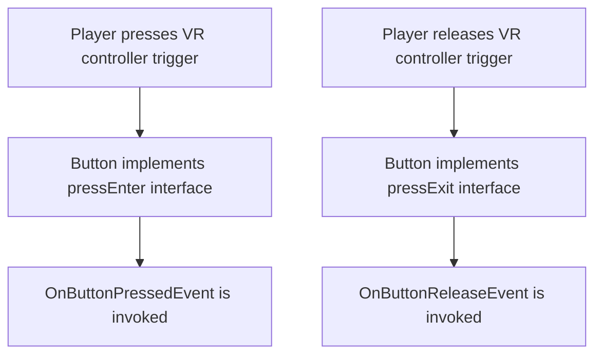

# TestAssignment-vr-crane-gasAnalyzer


**⚠️WARNING⚠️**
- you might need lfs installed

**CRANE CONTROLLER**
In the project you can move crane:
- **Forward:** move the crane girder forward
- **Back:** move the crane girder back
- **Right:** move the hois right
- **Left:** move the hoist left
- **Up:** lift up the hook
- **Down:** lower the hook
All buttons (*except for the <u>Up button</u>*) functionality is implemented by <ins>**EventButton.cs**</ins>. Up button relies on <ins>**DelayedEventButton.cs : EventButton**</ins>.  <ins>**DelayedEventButton.cs**</ins> is the button modified to send its main event after holding it long enough, also has option for invoking events on button down (*HoldStartedEvent*).

Let me elaborate further on *<ins>HOW</ins>* clicking buttons works here, in VR. Well we've got installed ***<ins>Vive Input Utility</ins>*** plugin installed and hence we have to use its API to initialize button clicking, grabbing and all the other kinds of interacting VR world. That means that we'll have to inherit from <ins>VIU interfaces</ins> in our <ins>**EventButton.cs**</ins> or : 
```
IColliderEventClickHandler, 
IColliderEventPressEnterHandler, 
IColliderEventPressExitHandler
```
These above made possible processing the logic of "button things" from invoking on-clikc or on-release events to visual feedback, which is drowning the clicked button down.
Let me show you:

#Gas Analyzer
Consists of:
- **<ins>Danger.cs</ins>** - object looking for objects in scene tagged with *Danger* tag and calculating the distance to the closest.
- **<ins>GasAnalyzerScreenUI</ins>** - its responsibility is gas analyzer screen UI. With **<ins>DelayedEventButton.cs</ins>** it is capable to turn off or turn on, switching its status on every button hold. Also when the status switches the screen plays "loading screen sequence" via a *Coroutine*.
